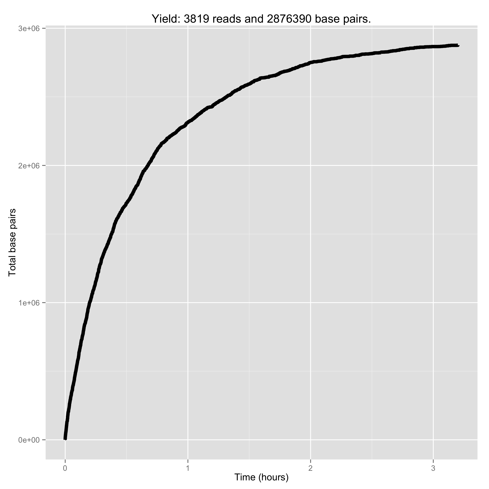

# Snack to Sequence

Group #3: The Minnows
 - Alex Kalicki (avk2116)
 - Lilly Wang (lfw2114)
 - Mike Curry (mjc2260)
 - Tia Zhao (tz2191)

### Question 3

The cumulative base pairs from passed and failed 2D reads are plotted below as
a function of time. To find the cumulative nucleotides, multiply the y-value of
the graph by 2 (as each base pair consists of 2 nucleotides).

Cumulative passed nucleotides:

Cumulative failed nucleotides:
