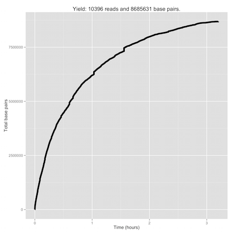

## Ubiquitous Genomics Hackathon #1: Snack to Sequence

Group #3: The Minnows
 - Alex Kalicki (avk2116)
 - Lilly Wang (lfw2114)
 - Mike Curry (mjc2260)
 - Tia Zhao (tz2191)

### Question 1

As instructed, we calculated the number of 1D and 2D reads classified as
"passed" versus the number classified as "failed". We also calculated the
fraction of reads that were 2D called in both the "pass" and "fail" folders with
the following results:

Passed Reads:
 - 3819 1D reads
 - 3819 2D reads
 - 50.00% of the "passed" reads were 2D

Failed Reads:
 - 10396 1D reads
 - 2300 2D reads
 - 18.12% of the "failed" reads were 2D

### Question 3

The cumulative base pairs from "passed" and "failed" 2D reads are plotted below
as a function of time. To find the cumulative nucleotides, multiply the y-values
of the graph by 2 (as each base pair consists of 2 nucleotides).

Cumulative "passed" nucleotides:

Cumulative "failed" nucleotides:

### Question 5

As described in the assignment, we calculated the base-calling quality mean
and standard deviation for 2D reads in both the "passed" and "failed"
directories. We then compared using the student t-test to get the following:

Passed Reads:
 - Number of bases: 2876390
 - Average base-calling quality: 4.17
 - Base-calling median: 4.12
 - Base-calling standard deviation: 0.51

Failed Reads:
 - Number of bases: 1375824
 - Average base-calling quality: 3.73
 - Base-calling median: 3.81
 - Base-calling standard deviation: 0.60

Our reads showed a disappointingly low quality score on a scale from 1-30. Based
off previous successes in MinION sequencing read quality scores, we believe our
poor result to come from a bad sample or experimental practice. However, we can
see that the average base-calling quality in the failed reads is consistently
below the average base-calling quality of the passed reads.

The student t-test for these results yielded a value of 786, which allows us to
reject the null-hypothesis with any reasonable confidence level.

After isolating the first and last hour reads from the rest of the data, we
received the following results:

First Hour "Passed" 2D read median base-quality: 4.12
Last Hours "Passed" 2D read median base-quality: 4.12

The fact that the median base-quality values for the first and last hour match
up so precisely is a good sign, as it suggests that the quality of the
sequencing from the MinION Nanopores is not degrading over time running.

### Question 9

The pace of the strand sequencing (sequence length per duration in pore) is
plotted below for both "passed" and "failed" reads. For each plot, we attempted
to find the best linear fit to the data. Note that outliers beyond the range of
the plotted graphs significantly skewed the predicted linear fit for the
"failed" 2D reads.

Pacing for "passed" reads:

Pacing for "failed" reads:

